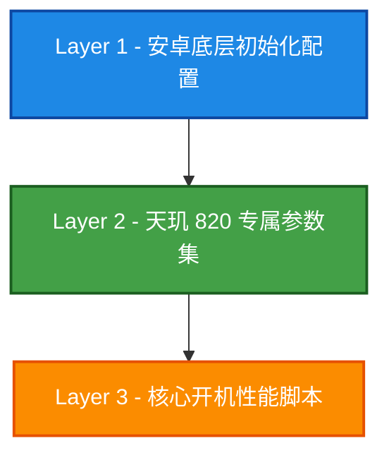

# 🚀 天玑 820 (MT6875) 专属网络满血模块

<div align="center">


**这是完全为联发科天玑 820 (MT6875) 量身打造的底层网络性能解锁模块。**

*全局满血，没有模式切换，绝不妥协。*

</div>

---

## 🌟 项目优势 (Why this module?)

本模块彻底抛弃了“兼容万物”的平庸思路，**100% 聚焦于榨干天玑 820 平台的网络潜力**。它的主要优点包括：

1. 🎯 **架构级精准调教**：所有的内核参数调整均建立在天玑 820 的 `4×A76 + 4×A55` 八核架构之上。
2. 🚀 **A76 大核中断绑定**：将基带 (`MT6875`) 与 Wi-Fi (`MT6631`) 的中断处理强制绑定到 4 颗 Cortex-A76 高性能核心上，大幅降低网络延迟。
3. 📡 **射频潜能全开**：强制解锁 5G Sub-6GHz 双载波聚合 (2CC CA)、LTE 5载波聚合 (5CC CA) 及 Wi-Fi 6 的 80MHz 2x2 MIMO 满血吞吐。
4. ⚡ **TCP/内核级重构**：将 TCP 缓冲区直接拉升至 64MB 并启用 BBR+fq 队列，完美匹配 5G 高达 4.7Gbps 的下行理论极速。
5. 🛡️ **严格的安全防呆**：拥有 5 重设备深度校验，从根本上杜绝了其他机型误刷导致系统崩溃的风险（非天玑 820 直接中断安装）。

---

## ⚡ 天玑 820 硬件规格


| 硬件规格           | 详细信息                                               |
| :-------------- | :-------------------------------------------------- |
| 🧠 **CPU**     | 4x Cortex-A76 @ 2.6GHz + 4x Cortex-A55 @ 2.0GHz    |
| 🎮 **GPU**     | Mali-G57 MC5 @ 900MHz                              |
| 🏭 **制程**      | 7nm                                                |
| 📡 **5G 基带**   | 集成式，Sub-6GHz，SA+NSA 双模                             |
| 🚀 **NR 载波聚合** | 2CC CA, 120MHz, 256QAM                             |
| 🌐 **NR 极速**   | 4.7Gbps 下行 / 2.3Gbps 上行                            |
| 📶 **LTE**     | Cat 18, 5CC CA, 256QAM, 4x4 MIMO                   |
| 🛜 **Wi-Fi**   | Wi-Fi 6 (802.11ax), 2x2 MIMO, 80MHz (搭配 MT6631 芯片) |


---

## 🏗️ 核心架构设计

本模块通过 3 个核心层级无缝协作，确保每一层都能达到极致吞吐量：



### 🔹 Layer 1: 系统底层文件 (Pre-userspace)

- `system/etc/init/mtk-bwmod.rc`: 针对 IPv6 和 Conntrack 并发进行底层扩容。
- `system/etc/sysctl.d/99-mtk-bwmod.conf`: 内核网络参数的全面覆盖。
- `system/etc/dhcpcd/dhcpcd.conf`: DHCP 极速优化 (快速失败, 1 RTT DHCP, 强制 Cloudflare DNS)。

### 🔹 Layer 2: 专属属性集 (system.prop)

多达 \~120 项针对 MT6875 硬件底层深度调优的配置：

- **数据网络**: LTE 5CC 聚合，5G Sub-6 2CC 聚合，天玑 820 专属频段优化。
- **无线网络**: 完全解锁 MT6631 硬件抽象层 (HAL)，锁定 80MHz 及 2x2 MIMO。
- **VoLTE/IMS**: 全面支持高清语音、AMR-WB、EVS、Opus 编码。
- **基带功耗**: 基于 7nm 制程基带的针对性电源调度。

### 🔹 Layer 3: 核心开机服务 (service.sh)

每次开机自动执行包含 27 个阶段的性能重构，完全依托 A76 核心组：

- `TCP/BBR`: 64MB 极限缓冲区与 BBR 拥塞控制算法。
- `中断亲和性`: 强制路由 MT6875 所有网络中断至 A76 性能丛集 (`f0`)。
- `NAPI & RPS`: 设置 32768 RPS 流量表与 NAPI budget 600 极致吞吐。
- `高级队列`: 启用 `tc qdisc fq` 以应对高并发网络。

---

## 🛡️ 天玑 820 (MT6875) 专属设备校验

**本模块极其挑剔！** 针对芯片的排他性是本项目的核心原则。
安装脚本 `customize.sh` 会在刷入时执行严格的 5 重硬件验证，**任何非 MT6875 设备都将被直接拒绝安装并中止进程**。

1. `ro.board.platform` 必须匹配 `mt6875`
2. `ro.vendor.mediatek.platform` 必须匹配 `MT6875`
3. `ro.soc.model` 必须包含 `Dimensity 820`
4. `ro.chipname` 必须匹配 `MT6875`
5. 读取内核设备树 `/proc/device-tree/compatible` 必须确认包含 `mt6875`

---

## 📥 安装与要求

### 📋 运行条件

- **处理器：** 必须且仅限 **天玑 820 (MT6875)**
- **Root 权限：** Magisk v24+ 
- **安卓版本：** Android 10+
- **系统类型：** MIUI

### 🛠️ 安装步骤

1. 下载最新发行版：`Dimensity820-NetBoost_v2.0.zip`
2. 打开 **Magisk** → 模块 → 从本地安装。
3. 选中压缩包，等待严苛的硬件校验通过。
4. **重启设备** — 满血网络性能将自动激活。

---

## 🔍 运行诊断

如果您想确认参数是否已在底层生效，可以通过查看内部日志验证：

```bash
# 查看开机核心脚本执行日志
adb shell cat /data/local/tmp/mtk_bwmod.log

# 查看 Post-fs-data 挂载阶段日志
adb shell cat /data/local/tmp/mtk_bwmod_postfs.log
```

---

## ⚠️ 免责声明

> \[!WARNING\]  
> 本模块对底层内核网络参数和基带配置的修改是**专门为天玑 820 SoC 设计的**。本模块不包含任何“省电模式”，始终以最高网络性能运行。如果您需要完全还原系统的网络状态，只需在 Magisk/KernelSU 中禁用本模块并重启即可，不会对系统造成不可逆的硬件影响。

---

