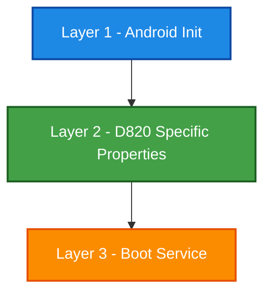

# 🚀 Dimensity 820 (MT6875) Network Mod

<div align="center">


**The ultimate network performance module exclusively tailored for MediaTek Dimensity 820 (MT6875).**

*Always-on max performance. No profiles, no compromises.*

</div>

---

## ⚡ Dimensity 820 Specs

| Hardware | Specification |
|:---|:---|
| 🧠 **CPU** | 4x Cortex-A76 @ 2.6GHz + 4x Cortex-A55 @ 2.0GHz |
| 🎮 **GPU** | Mali-G57 MC5 @ 900MHz |
| 🏭 **Process** | TSMC 7nm |
| 📡 **5G Modem**| Integrated, Sub-6GHz, SA+NSA |
| 🚀 **NR CA** | 2CC CA, 120MHz, 256QAM |
| 🌐 **NR Speed**| 4.7Gbps DL / 2.3Gbps UL |
| 📶 **LTE** | Cat 18, 5CC CA, 256QAM, 4x4 MIMO |
| 🛜 **WiFi** | Wi-Fi 6 (802.11ax), 2x2 MIMO, 80MHz (MT6631) |
| 🟦 **Bluetooth**| 5.1 |

---

## 🏗️ Architecture Design

Our mod operates seamlessly across 3 main layers, ensuring maximum throughput at every level:



### 🔹 Layer 1: System Files (Pre-userspace)
- `system/etc/init/mtk-bwmod.rc`: Android init script for IPv6 & Conntrack scaling.
- `system/etc/sysctl.d/99-mtk-bwmod.conf`: Kernel network parameter fallback.
- `system/etc/dhcpcd/dhcpcd.conf`: DHCP optimization (Fast fail, 1 RTT DHCP, Cloudflare override).

### 🔹 Layer 2: Properties (system.prop)
~120 highly tuned parameters targeting MT6875 hardware specifically:
* **LTE/NR**: 5CC LTE CA, Sub-6 2CC CA, D820 bands optimization.
* **WiFi**: MT6631 HAL unlock, 80MHz 2x2 MIMO.
* **VoLTE/IMS**: Full HD voice, AMR-WB, EVS, Opus support.
* **Modem Power**: 7nm baseband specific tuning.

### 🔹 Layer 3: Boot Service (service.sh)
27-stage optimization executing on every boot, leveraging the A76 performance cluster:
* `TCP/BBR`: 64MB buffers & BBR congestion control.
* `IRQ Affinity`: Redirecting MT6875 IRQs to A76 cluster (`f0`).
* `NAPI & RPS`: 32768 RPS flow table & NAPI budget 600.
* `tc qdisc fq`: Advanced queue discipline.

---

## ⚙️ Fixed Performance Parameters

Unlike adaptive scripts, this mod enforces rigid, high-performance ceilings globally:

| Parameter | Optimized Value | Parameter | Optimized Value |
|:---|:---|:---|:---|
| **TCP Buffers** | `64MB` | **Congestion Control** | `BBR` |
| **qdisc** | `fq` | **IRQ Coalescing** | `50µs / 32 frames` |
| **Conntrack Max**| `2,000,000` | **WiFi Power Save** | ❌ `OFF` |
| **A76 Up Rate** | `0µs (instant)`| **Fast Dormancy** | ❌ `OFF` |

---

## 🛡️ Strict Device Verification

This module is **extremely chip-specific**. The `customize.sh` script runs a 5-step hardware check during installation. **It will abort on ANY non-MT6875 device**.

1. `ro.board.platform` = `mt6875`
2. `ro.vendor.mediatek.platform` = `MT6875`
3. `ro.soc.model` = `Dimensity 820`
4. `ro.chipname` = `MT6875`
5. `/proc/device-tree/compatible` matches `mt6875`

---

## 📥 Installation & Requirements

### 📋 Prerequisites
- **SoC:** Dimensity 820 (MT6875) — **exclusively**
- **Root:** Magisk v24+ or KernelSU
- **Android:** 10+
- **ROM:** AOSP, MIUI, HyperOS, ColorOS, any custom ROM

### 🛠️ Steps
1. Download the latest release: `mtk_bwmod_d820_v2.0.zip`
2. Open **Magisk/KernelSU** → Modules → Install from storage.
3. Select the zip file and wait for the strict validation.
4. **Reboot** — Max performance is activated automatically.

---

## 🔍 Diagnostics

You can verify the runtime parameters by checking the internal logs:

```bash
# View boot service execution log
adb shell cat /data/local/tmp/mtk_bwmod.log

# View post-fs-data patch log
adb shell cat /data/local/tmp/mtk_bwmod_postfs.log
```

---

## ⚠️ Disclaimer

> [!WARNING]
> This module modifies low-level kernel network parameters and modem configurations strictly designed for the Dimensity 820 SoC. There are no profiles—it runs at maximum performance. To completely revert all changes, simply disable the module in Magisk and reboot.

---
<div align="center">
Made with ❤️ by Elvan
</div>
